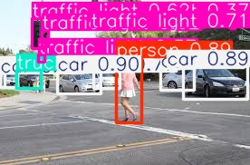

## Object Detection with YOLOv5

##  From Images
This script performs object detection on an image using a pre-trained YOLOv5 model with OpenCV and PyTorch. It demonstrates how to load a model, perform detection, render results, and display or save the annotated image.

### Code Overview

1. **Model Loading**:
   - Loads a pre-trained YOLOv5 model (`yolov5s`) from the `ultralytics` repository using PyTorch's `torch.hub.load` function.

2. **Image Loading**:
   - Reads the image file specified by `image_path` into the script using OpenCV's `cv2.imread` function.

3. **Object Detection**:
   - Applies the YOLOv5 model to the loaded image to detect objects, returning results with bounding boxes and class labels.

4. **Rendering Results**:
   - Renders the detection results on the image using the `results.render()` method, overlaying bounding boxes and labels.

5. **Image Resizing**:
   - Resizes the annotated image to a specified dimension (800x600 in this example) using OpenCV's `cv2.resize` function.

6. **Displaying the Image**:
   - Displays the resized, annotated image in an OpenCV window. The window remains open until a key is pressed.

7. **Saving the Image**:
   - Optionally saves the annotated image to a file (`output_image.jpg`) using OpenCV's `cv2.imwrite` function.

8. **Cleanup**:
   - Closes the OpenCV window with `cv2.destroyAllWindows()` to free up resources.

### Output Image

Here is an example of the output image after performing object detection:

This script provides a simple example of using YOLOv5 for object detection and visualizing the results with OpenCV.

## Real-Time Object Detection From Video

This script performs real-time object detection using a pre-trained YOLOv5 model with OpenCV and PyTorch. It captures video frames from a camera or a video file, applies object detection, and displays the annotated frames.

### Code Overview

1. **Model Loading**:
   - Loads a pre-trained YOLOv5 model (`yolov5s`) from the `ultralytics` repository using PyTorch's `torch.hub.load` function.

2. **Initialize Video Stream**:
   - Initializes a video capture object with OpenCV's `cv2.VideoCapture`. By default, it captures video from the webcam (device index 0). You can change this to a video file path if needed.

3. **Real-Time Detection**:
   - Continuously captures frames from the video stream.
   - Applies the YOLOv5 model to each frame to detect objects, returning results with bounding boxes and class labels.

4. **Rendering Results**:
   - Renders the detection results on each frame using the `results.render()` method, overlaying bounding boxes and labels.

5. **Displaying the Frame**:
   - Displays the annotated frame in an OpenCV window titled "Object Detection". The window updates with each frame of the video stream.

6. **Exit Condition**:
   - Allows the user to exit the video stream by pressing the 'q' key.

7. **Cleanup**:
   - Releases the video capture object and closes all OpenCV windows when done.

### Output

The script provides real-time object detection on video frames. If running with a webcam, it will display a live feed with detected objects highlighted. For demonstration purposes, if you have a sample frame with detected objects, you can include it as follows:

This example shows how to use YOLOv5 for real-time object detection in a video stream or webcam feed.

